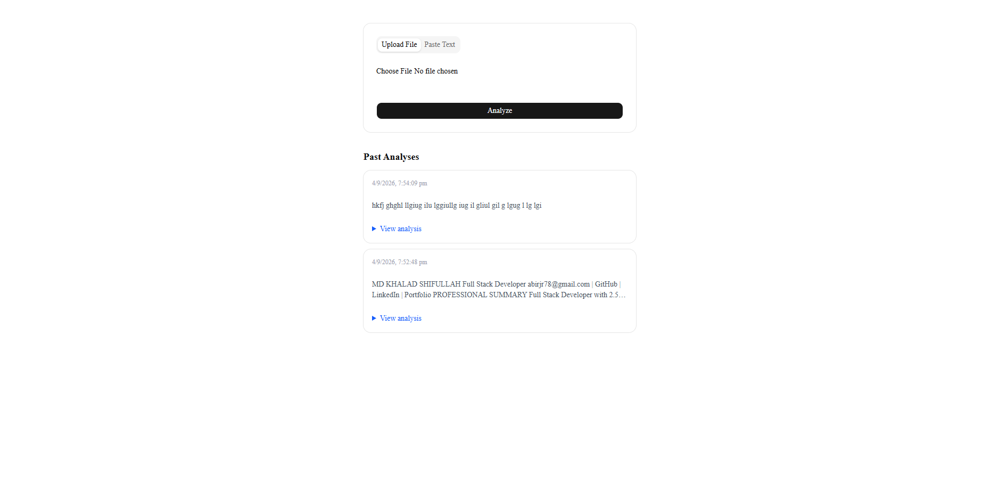

# AI Resume Analyzer

An AI-powered tool that analyzes resumes and general content, providing strengths, areas for improvement, and a summary — via file upload or pasted text.

🔗 **Live demo:** https://ai-resume-anlyzer-omega.vercel.app

   

## Features

- Upload a PDF or DOCX resume, or paste text directly
- AI-generated analysis: key strengths, areas for improvement, and an overall summary
- Analysis history stored and viewable without leaving the page
- Clean error handling for invalid files and AI service failures

## Tech Stack

**Frontend:** Next.js, TypeScript, Tailwind CSS, shadcn/ui  
**Backend:** Python, FastAPI, SQLAlchemy, SQLite  
**AI:** Google Gemini API  
**File Parsing:** pdfplumber, python-docx  
**Deployment:** Vercel (frontend), Render (backend)

## How It Works

1. User uploads a resume file or pastes text through the Next.js frontend
2. If a file is uploaded, the FastAPI backend extracts raw text using pdfplumber (PDF) or python-docx (DOCX)
3. Extracted or pasted text is sent to Google Gemini with a structured prompt
4. The AI's analysis is returned, displayed to the user, and saved to a SQLite database
5. Past analyses are retrievable and viewable in a history list on the same page

## Running Locally

**Backend**
```bash
cd backend
python3 -m venv venv
source venv/bin/activate  # Windows: venv\Scripts\activate
pip install -r requirements.txt
# Create a .env file with: GEMINI_API_KEY=your_key_here
uvicorn main:app --reload
```

**Frontend**
```bash
cd frontend
npm install
# Create a .env.local file with: NEXT_PUBLIC_API_URL=http://127.0.0.1:8000
npm run dev
```

## Note

The backend is hosted on Render's free tier, which spins down after inactivity — the first request after idle time may take 30–60 seconds to respond.